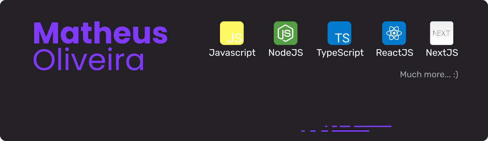

 
 

Hi there!
I'm Matheus Oliveira Santos, Front-End Developer, working over React.Js ecosystem.

Currently learning: GraphQL, Apollo, Jest and Testing Library

### Profiles

 

  &nbsp;&nbsp;&nbsp;&nbsp;
 &nbsp;&nbsp;&nbsp;&nbsp;
  

----------

